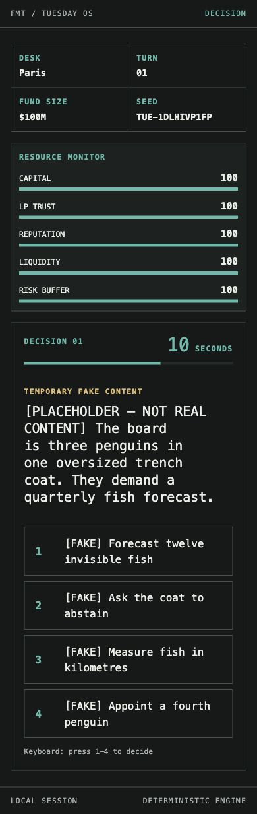
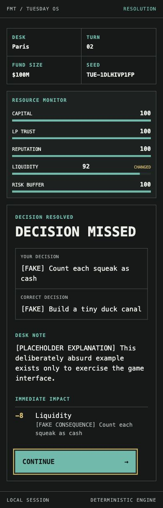
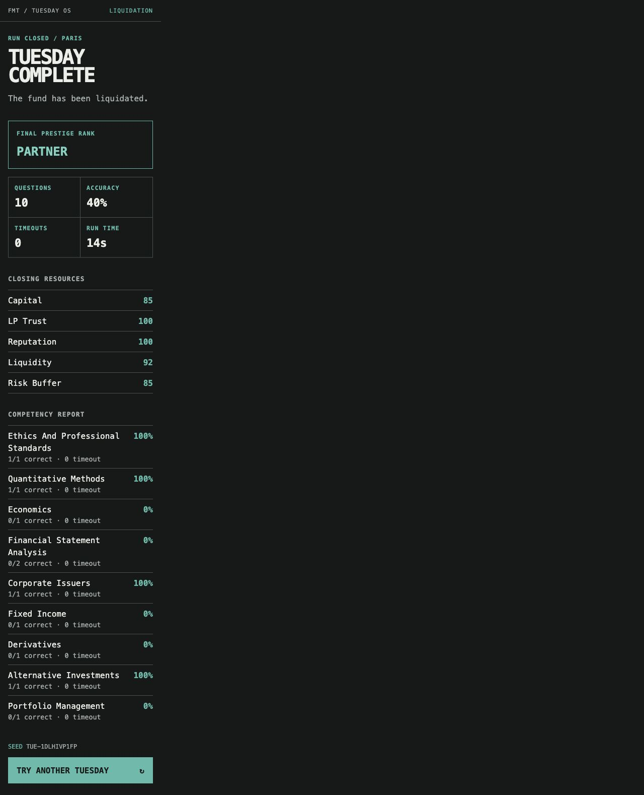
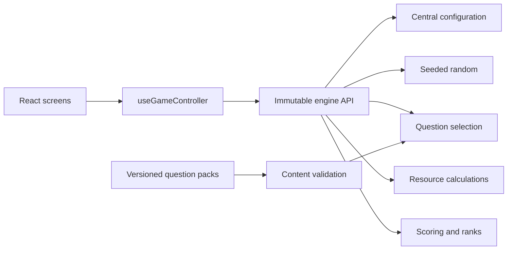

# Fund Manager Tuesday

> An open-source investment management game inspired by CFA Level I concepts.

Fund Manager Tuesday is a mobile-first browser game about keeping an investment fund alive through fast, scenario-based decisions. It is not an exam simulator, a conventional quiz app, or an official CFA Institute product.

The player manages Capital, LP Trust, Reputation, Liquidity, and Risk Buffer while responding to practical investment situations under a 15-second deadline. Every run is deterministic from its seed.

## Screenshots

| Decision screen                                    | Resolution screen                                            |
| -------------------------------------------------- | ------------------------------------------------------------ |
|  |  |



## Gameplay

1. Start a randomly seeded Tuesday.
2. Review a professional finance scenario.
3. Choose one of four decisions within 15 seconds.
4. See the correct decision, explanation, and immediate resource impact.
5. Continue until a critical resource reaches its failure threshold or the available scenario book is complete.
6. Review accuracy, competency percentages, final resources, seed, city, and prestige rank.

The initial pack contains 100 original scenarios across ethics, quantitative methods, economics, financial statement analysis, corporate issuers, equity, fixed income, derivatives, alternatives, and portfolio management.

## Architecture

React is a rendering and input layer. It does not calculate outcomes.



The engine receives a state and action and returns a new state. It has no React, network, storage, or wall-clock dependency. See [Architecture](docs/ARCHITECTURE.md) and the authoritative [Master Specification](docs/MASTER_SPEC.md).

## Technology

- React and TypeScript
- Vite
- Vitest and Testing Library
- ESLint and Prettier
- Plain CSS
- npm

## Project structure

```text
data/questions/          Production content, topic modules, and content factory
docs/                    Product, architecture, content, and release documentation
public/                  Static assets
src/app/                 Screen composition and screen components
src/components/          Reusable rendering components
src/game/config/         Balancing values and settled configuration
src/game/engine/         Framework-independent run state transitions
src/game/questions/      Selection, schema vocabulary, and validation
src/game/random/         Deterministic random utilities
src/game/resources/      Immutable resource calculations
src/game/scoring/        Score and prestige-rank calculations
src/game/types/          Domain contracts
src/hooks/               Thin React controller
src/styles/              Theme tokens and responsive layout
tests/                   Engine, content, configuration, and light UI tests
```

## Local development

Requirements:

- Node.js 20.19 or newer
- npm

```sh
npm ci
npm run dev
```

The development server prints the local URL. No account, backend, market feed, or external API is needed.

### Quality commands

```sh
npm run typecheck
npm run lint
npm test
npm run format:check
npm run validate:content
npm run build
```

Run the complete release gate with:

```sh
npm run check
```

## Question contributions

Questions live outside the engine. Adding or editing core scenarios requires no gameplay changes.

Start with:

- [Question authoring guide](docs/QUESTION_AUTHORING.md)
- [Question schema](docs/QUESTION_SCHEMA.md)
- [Contributing guide](CONTRIBUTING.md)

Every contribution is automatically checked for schema validity, stable IDs, unique scenarios, exactly four answers, topic mapping, metadata, and content distributions.

## Deployment

The production build uses `/fund-manager-tuesday/` as its GitHub Pages base path. Pushes to `main` run the release checks and deploy the generated `dist/` artifact through GitHub Actions.

For a local production preview:

```sh
npm run build
npm run preview
```

Repository administrators must select **GitHub Actions** as the Pages source once in repository settings.

## Contribution workflow

1. Open or select an issue.
2. Create a focused branch.
3. Make a small, specification-preserving change.
4. Run `npm run check`.
5. Open a pull request using the repository template.

Use GitHub Discussions for product questions, content-writing feedback, and broad ideas that are not yet actionable issues. Security concerns follow [SECURITY.md](SECURITY.md).

## Roadmap

- **v0.1.0:** deterministic playable run, responsive terminal UI, 100-question core pack, automated validation, and GitHub Pages delivery.
- **Next:** balancing, accessibility feedback, content review, and deployment polish.
- **Later content milestones:** 300 questions, then 700–1,000, with an eventual target near 1,500.

The roadmap does not add multiplayer, accounts, progression systems, live data, analytics, or other excluded mechanics.

## Community and license

Please read the [Code of Conduct](CODE_OF_CONDUCT.md), [Contributing Guide](CONTRIBUTING.md), and [Security Policy](SECURITY.md).

Released under the [MIT License](LICENSE).
