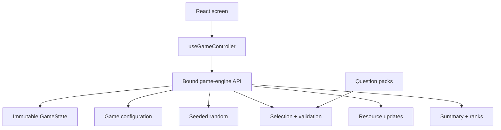
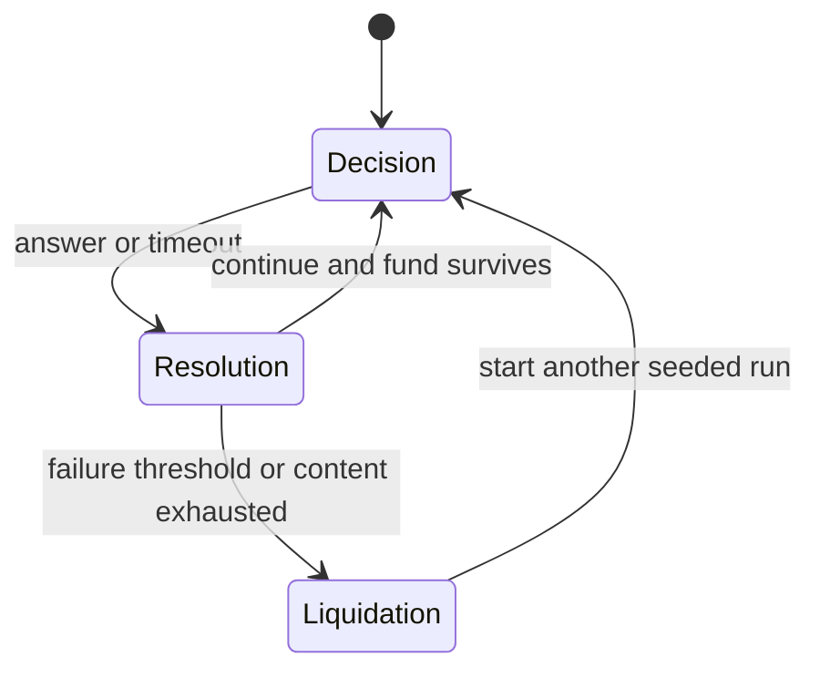

# Architecture

## Principle

React renders state; the engine owns rules.

The engine is framework-independent and deterministic. It does not access the DOM, clock, storage, network, or React. Browser code supplies elapsed time and player actions, then renders the new immutable state.

## Turn flow

The resolution state is explicit. The UI never skips the explanation automatically.

## Determinism

A run is reproduced by the same:

- seed;
- game version;
- compatible content version;
- configuration.

Question candidates are sorted by stable pack and question IDs before weighted seeded selection. Question order contains no duplicates.

## Module boundaries

- `src/game/types`: data contracts only.
- `src/game/config`: timer, resources, cities, difficulty stages, scoring, and thresholds.
- `src/game/random`: deterministic pseudo-random generator.
- `src/game/questions`: validation and deterministic weighted order.
- `src/game/resources`: clamping, diffs, snapshots, and failure detection.
- `src/game/scoring`: score and rank calculation.
- `src/game/engine`: public transition API.
- `src/hooks/useGameController.ts`: browser timer cadence, keyboard events, and React state.
- `src/app` and `src/components`: semantic rendering only.
- `data/questions`: versioned content.

## Public engine API

`createGameEngine` binds question packs and configuration and exposes:

- `createRun`
- `getCurrentQuestion`
- `updateTimer`
- `submitAnswer`
- `resolveTimeout`
- `advance`
- `isFinished`
- `getCompetencySummary`
- `getSummary`

Every transition returns a new state and rejects invalid phase transitions.

## Testing strategy

Most tests target the framework-independent engine. Light React tests verify integration, keyboard input, timeout delegation, screen transitions, and run completion. Content tests validate schema and distribution separately.
